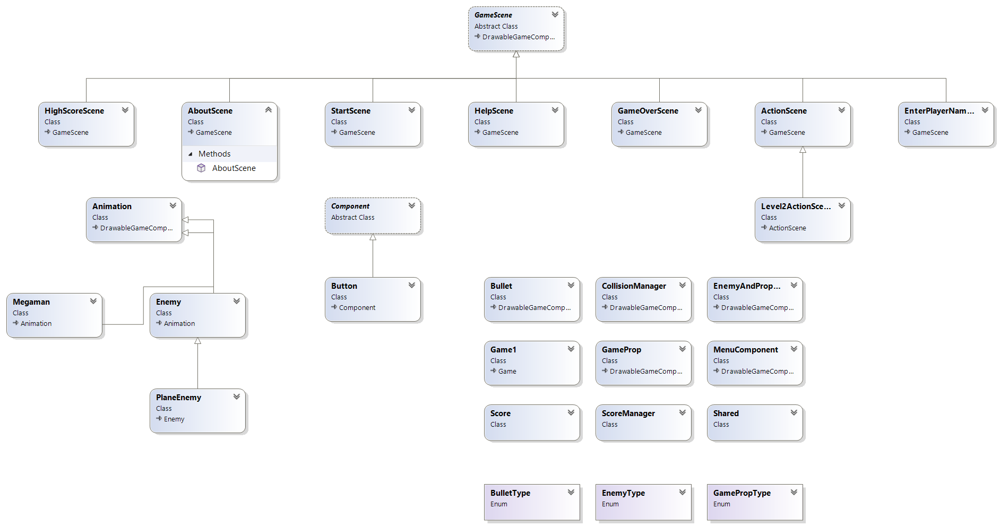
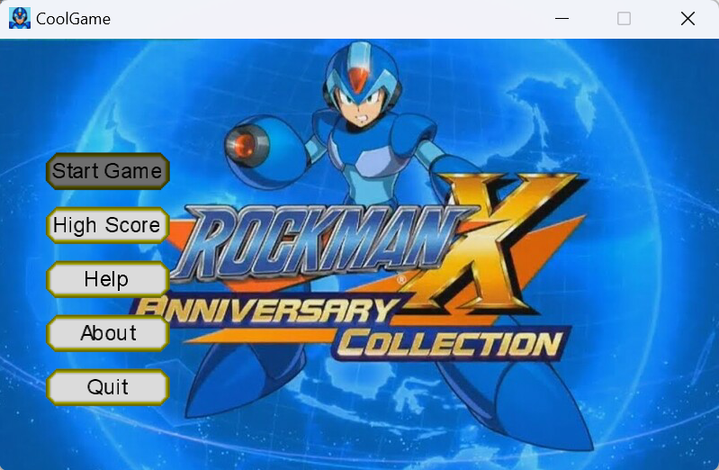
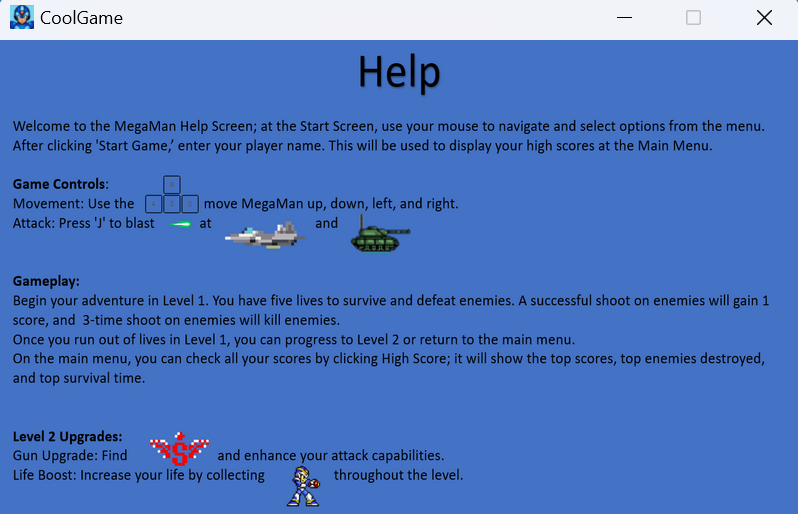
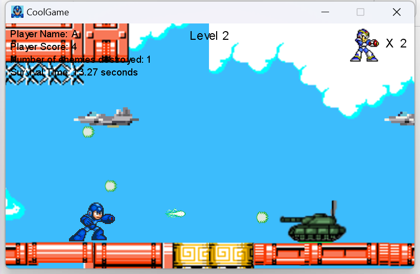

# MegaMan Tribute Game

## Overview
Experience the thrill of the classic with the MegaMan Tribute Game. Jump into action with MegaMan as you navigate through levels, battle formidable foes, and strive for the high score in this homage to Mega Man X3.

## Features
- Retro-style gameplay with a nod to Mega Man X3.
- Track your progress with a local leaderboard.
- Immersive sound effects and catchy background tunes.
- Multiple levels filled with unique challenges and power-ups.
- Actively developed for an ever-improving gaming experience.

## Gameplay
- **Controls**: Navigate with arrow keys and use 'J' to unleash attacks.
- **Objective**: Keep your five lives, vanquish enemies, and accumulate points.
- **Progress**: Conquer levels and climb the leaderboard with your high score.
- **Upgrades**: Discover power-ups to augment your attacks and increase your vitality.

## Installation
1. Download the OneClickInstaller package.
2. Run the setup file contained within to install the game.
3. Launch the game and start your adventure!

## Contributing
Join the development! Fork the repo, craft your feature, and propose your pull request.

## Support
Encounter an issue? Have a question? Open an issue on our [GitHub repository](#).

## License
This code is strictly for educational and reference purposes only. Any commercial use or submission as coursework is prohibited.

## Class Diagram
Below is the class diagram that outlines the structure of our game:

## Game panel
Here are some of the interfaces in this game:
- **The menu of the game**:
  

- **The instruction of the game**:

- **The play sense of the game**:

